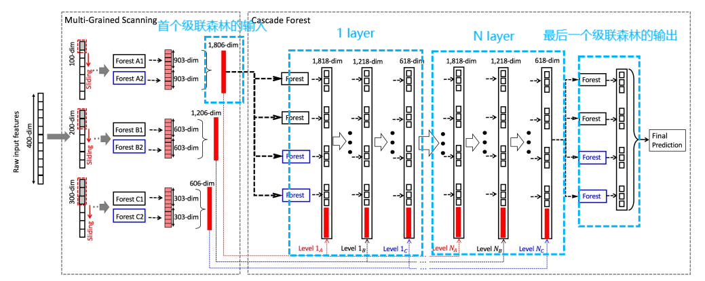

# 深度森林(DeepForest)

2024/5/19

## 深度森林的本质

一种决策树的集成方法(级联森林的级联)；

## 深度森林的优点

- DeepForest的超参数较少，好调参。
- DeepForest即使使用规模较小的数据集，效果也很不错。
- DeepForest是边训练边构建模型，可以根据训练效果自适应模型复杂度。

## 深度森林的原稿

链接：[https://pan.baidu.com/s/1TJQE5HaHilfosSm6Wo36hw?pwd=6ing](https://pan.baidu.com/s/1TJQE5HaHilfosSm6Wo36hw?pwd=6ing)
提取码：6ing

## 深度森林的结构

1. DeepForest是级联层的序贯叠加；
   - “1 Layer”为第一层级联层，“N Layer”为最后一层级联层；
   - 设置为N个粒度的DeepForest的每个级联层，都拥有一次为N种粒度的多粒度扫描和N个对应粒度的级联森林；
2. 粒度扫描，即按滑动窗口形状提取特征向量。
   - 粒度，即滑动窗口的形状。
   - 除开“1 Layer”的输入数据与“N Layer”的输出数据外，其余每个深度森林的输出向量都会按顺序拼接粒度扫描的特征向量；
3. 级联森林是随机森林的平均集合，通常设置2个随机森林和2个完全随机森林；
4. 随机森林是决策树的平均集合。
