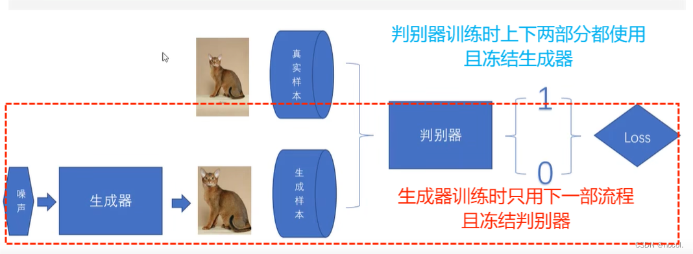

# 对抗生成式网络(GAN)

2024/5/21

## GAN的本质

GAN由两个模型组成的训练框架：

一个生成模型G，以噪音向量为训练数据，以1的矩阵为目的标签训练生成虚假的样本；(生成器G的损失函数来自于判别器D)

一个判别模型D，用于估计样本是否来自训练数据而非生成模型G；

这两个模型通过对抗过程进行交替训练，其中G试图欺骗D，而D则努力区分真实数据和生成数据。（其本质是判别器D与生成器G对于同一损失函数的追求相反;）

## GAN的相关论文

链接：[https://pan.baidu.com/s/1TbaaCcV4iUtt1HmHn9_Qyw?pwd=tsq8](https://pan.baidu.com/s/1TbaaCcV4iUtt1HmHn9_Qyw?pwd=tsq8)
提取码：tsq8

## GAN的损失函数：

## GAN的训练流程

